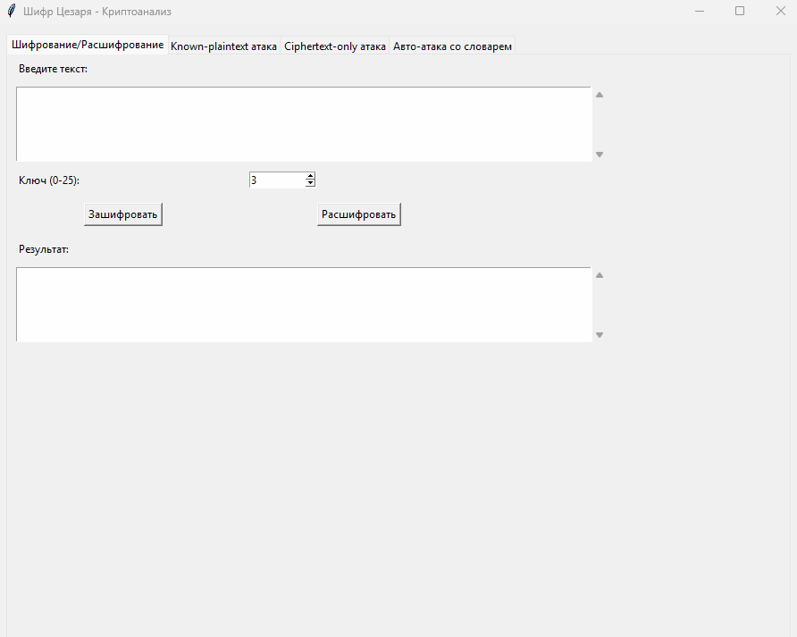

# CaesarDecryptor
Программа для шифрования / дешифрования слов с использованием шифра Цезаря. Доступна возможность определять ключ по паре расшифрованного слова и его зашифрованного варианта.   
Можно определять расшифрованный вариант слова путем перебора каждого возможного ключа, либо же с использованием словаря. Во втором случае программе требуется доступ в интернет для подключения словаря с более чем 370 000 английских слов. При отсутствии интернета используется маленький встроенный словарь.   
Программа работает только с английским алфавитом.

Демонстрация работы программы

